<div align="center">


<br>


</div>

---

# 👨‍💻 About Me

<div align="center">

### Building real-world software while continuously learning.

</div>

I'm a **Full Stack Web Developer** interested in building modern, scalable and interactive applications.

- 🚀 Building full-stack web applications
- 🎨 Strong focus on modern frontend development and interactive UI
- ⚙️ Expanding deeper into backend development and system architecture
- 🤖 Exploring AI agents, RAG systems and automation
- ☁️ Learning DevOps, Docker, CI/CD and cloud infrastructure
- 📚 Currently strengthening programming fundamentals with Java
- 🛠️ Learning by building real-world projects

---

# ⚡ Tech Stack

<details open>
<summary><b>🎨 Frontend Development</b></summary>

<br>


<br><br>

`HTML5` `CSS3` `JavaScript` `TypeScript`

`React` `Next.js` `Tailwind CSS` `Bootstrap`

`Vite` `Redux Toolkit`

`GSAP` `Framer Motion` `Lenis`

`Responsive Design` `Modern UI` `Web Animations`

</details>

<br>

<details open>
<summary><b>⚙️ Backend Development</b></summary>

<br>


<br><br>

`Node.js` `Express.js` `REST APIs`

`JWT` `OAuth` `Socket.IO`

`Cloudinary` `Authentication` `Authorization`

`API Integration` `Backend Architecture`

</details>

<br>

<details open>
<summary><b>🤖 AI & Agentic Systems</b></summary>

<br>


<br><br>

`AI Agents` `Multi-Agent Systems` `RAG`

`LangChain` `LangGraph` `LLM Integration`

`AI Automation` `AI Workflows`

`Vector Databases`

</details>

<br>

<details open>
<summary><b>🗄️ Databases & Storage</b></summary>

<br>


<br><br>

`MongoDB` `PostgreSQL` `Redis` `Supabase`

`Database Design` `Data Modeling`

`Cloudinary` `Database Integration`

</details>

<br>

<details open>
<summary><b>☁️ DevOps & Cloud</b></summary>

<br>


<br><br>

`Git` `GitHub` `Docker` `Kubernetes`

`Linux` `Nginx` `CI/CD`

`AWS` `Vercel` `Netlify`

`Render` `Railway` `Hostinger`

</details>

<br>

<details>
<summary><b>🔧 Tools & Development Environment</b></summary>

<br>


<br><br>

`VS Code` `IntelliJ IDEA` `Postman`

`Thunder Client` `Figma`

`ESLint` `Prettier` `WSL`

</details>

---

# 🚀 Featured Projects

<div align="center">

<table>
<tr>

<td width="33%" valign="top">

<h3 align="center">🌐 VibeZGram</h3>

<p align="center">
A modern social media web application with interactive features and real-time communication.
</p>

<p align="center">
<a href="https://github.com/aksh17vk/vibezgram">

</a>
</p>

**Features**

- Social media experience
- Likes and comments
- Notifications
- Real-time chat
- Interactive UI
- Responsive design

</td>

<td width="33%" valign="top">

<h3 align="center">🤖 SkillPilot AI</h3>

<p align="center">
An AI-powered career platform designed to help users understand their skills and career direction.
</p>

<p align="center">
<a href="https://github.com/aksh17vk/skillpilot-ai">

</a>
</p>

**Features**

- Resume analysis
- Job description analysis
- Skill-gap detection
- Personalized learning roadmap
- Assessments
- AI-powered assistance

</td>

<td width="33%" valign="top">

<h3 align="center">🚀 Inovixx</h3>

<p align="center">
A technology initiative focused on building AI-powered products, automation systems and software solutions.
</p>

<p align="center">
<a href="https://github.com/aksh17vk/inovixx">

</a>
</p>

**Focus**

- AI-powered products
- AI automation
- Agentic systems
- Software products
- Product development

</td>

</tr>
</table>

</div>

---

# 🎯 Currently Focused On

<table>
<tr>

<td width="50%" valign="top">

## 🌐 Full Stack Development

Going deeper into backend development and building complete applications.

**Working With**

- REST APIs
- Authentication
- Authorization
- Databases
- Real-time systems
- Backend architecture

</td>

<td width="50%" valign="top">

## 🤖 AI Systems

Exploring practical applications of AI in software products.

**Exploring**

- AI Agents
- RAG
- Multi-Agent Systems
- LLM Applications
- LangChain
- LangGraph
- Automation

</td>

</tr>

<tr>

<td width="50%" valign="top">

## ☁️ DevOps

Learning how applications are developed, deployed and maintained in production.

**Learning**

- Linux
- Docker
- CI/CD
- Kubernetes
- AWS
- Cloud Deployment
- Nginx

</td>

<td width="50%" valign="top">

## 📚 Java

Strengthening programming fundamentals and problem-solving.

**Learning**

- Java
- OOP
- Data Structures
- Algorithms
- Problem Solving

</td>

</tr>
</table>

---

# 📚 Learning Roadmap

<div align="center">

| Area | Technologies / Concepts |
|:---:|:---|
| ☕ Programming | Java • OOP • DSA |
| 🎨 Frontend | React • Next.js • TypeScript |
| ⚙️ Backend | Node.js • Express.js • REST APIs |
| 🗄️ Databases | MongoDB • PostgreSQL • Redis |
| 🤖 AI | RAG • AI Agents • LangChain • LangGraph |
| 🐳 DevOps | Docker • Linux • CI/CD |
| ☁️ Cloud | AWS • Deployment • Infrastructure |
| ☸️ Orchestration | Kubernetes |
| 🧠 Architecture | APIs • System Design • Scalable Applications |

</div>

---

# 📊 GitHub Analytics

<div align="center">




</div>

---

# 🐍 Contribution Snake

<div align="center">

<picture>

<source
  media="(prefers-color-scheme: dark)"
  srcset="https://raw.githubusercontent.com/aksh17vk/aksh17vk/output/github-contribution-grid-snake-dark.svg"
/>

<source
  media="(prefers-color-scheme: light)"
  srcset="https://raw.githubusercontent.com/aksh17vk/aksh17vk/output/github-contribution-grid-snake.svg"
/>


</picture>

</div>

---

# 🏆 GitHub Achievements

<div align="center">


</div>

---

# 🔥 My Build Philosophy

<div align="center">

```text
┌─────────────┐
│    LEARN    │
└──────┬──────┘
       ↓
┌─────────────┐
│    BUILD    │
└──────┬──────┘
       ↓
┌─────────────┐
│    TEST     │
└──────┬──────┘
       ↓
┌─────────────┐
│    BREAK    │
└──────┬──────┘
       ↓
┌─────────────┐
│     FIX     │
└──────┬──────┘
       ↓
┌─────────────┐
│   IMPROVE   │
└──────┬──────┘
       │
       └──────────────→ 🔁
```

</div>

> Build first.  
> Find problems.  
> Understand them.  
> Fix them.  
> Improve the system.

---

# 🎯 Goals

- Build production-ready full-stack applications
- Become stronger in backend engineering
- Learn system design and scalable architecture
- Build practical AI-powered products
- Understand DevOps and cloud infrastructure
- Contribute to meaningful open-source projects
- Turn ideas into working software
- Continuously improve through real-world projects

---

# ⚡ Developer Mindset

<div align="center">

### `Think → Build → Break → Learn → Improve`

<br>

I believe the fastest way to grow as a developer is to build things that force you to solve problems you haven't solved before.

<br>

### Building today. Learning every day.

</div>

---

# 🤝 Let's Connect

<div align="center">

I'm open to **interesting projects, collaborations, technical discussions and learning opportunities.**

<br><br>

<a href="https://github.com/aksh17vk">

</a>

<a href="https://www.linkedin.com/in/aksh-tiwari-423252380/">

</a>

<a href="https://www.instagram.com/akshtiwari_017/">

</a>

<a href="https://x.com/akshtiwari_017">

</a>

<a href="mailto:taksh9655@gmail.com">

</a>

<br><br>

### 🌐 Portfolio

**Coming Soon**

<br><br>

### `Code. Build. Learn. Repeat.`

</div>

---

<div align="center">


</div>
